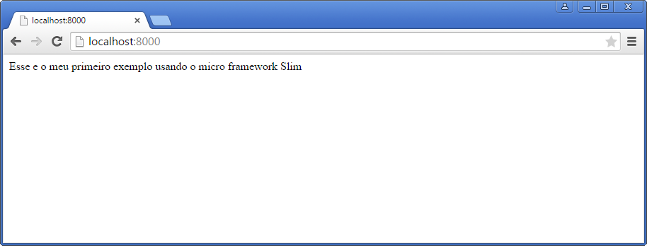
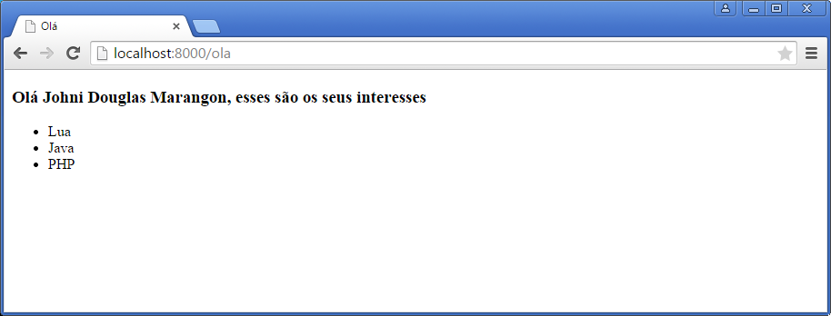

# Preparando o ambiente de desenvolvimento

Ter um ambiente de desenvolvimento adequando é muito importante para a produtividade durante um projeto, nesse capítulo vamos ensinar a instalar e configurar as ferramentas que iremos utilizar durante a leitura desse *e-book* e fazer um *bootstrap* do projeto.

### Instalando o PHP

A instalação do PHP é relativamente fácil, tanto no Linux como no Windows. 

O uso de uma IDE de desenvolvimento é recomendado, para escrever esse e-book utilizamos o  PhpStorm, `https://www.jetbrains.com/phpstorm/`, mas você pode escolher a IDE de sua preferência ou simplesmente utilizar um editor de texto.

#### Linux

Eu vou desmontar com a instalação do PHP utilizando o **apt-get** que é um recurso desenvolvido para distribuições Debian e permite a instalação e a atualização de pacotes.

No terminal execute o seguinte comando:

```
sudo apt-get update
sudo apt-get install apache2
sudo apt-get install php5 libapache2-mod-php5 php5-mcrypt
```
Para usar o PHP é necessário instalar um servidor web, nesse caso instalamos o Apache, `http://httpd.apache.org/`.

#### Windows

A maneira mais indicada para instalação do PHP no Windows é utilizar um ambiente de desenvolvimento como XAMPP ou WampServer, essas ferramentas possuem um instalador e já deixam o PHP configurado e executando com um servidor web sem muito esforço.

Nesse post `http://www.johnidouglas.com.br/category/programacao/php-programacao/` é possível encontrar uma lista de ambientes de desenvolvimento para Windows.

### Instalando o Composer

O uso de ferramentas que fazem a gestão de dependências é fantástico, com pouco esforço você consegue configurar e usar bibliotecas de terceiros em seus projetos.

O Composer é uma ferramenta indispensável quando vamos criar um projeto em PHP, ele faz a gestão de dependências de bibliotecas e frameworks de forma prática e simples. O arquivo `composer.json` possui as informações dos pacotes, e no diretório `vendor` estão armazenados os arquivos dasbibliotecas.

#### Linux
Para instalar o Composer no Linux é necessário apenas executar o comando `curl -sS https://getcomposer.org/installer | php`  

Execute o comando `sudo mv composer.phar /usr/local/bin/composer` para tornar a instalação do Composer global.

Após finalizar a instalação execute o comando `composer`, se esse comando não funcionar tente `php composer.phar`.

#### Windows

Para instalar o Composer no Windows a maneira mais fácil e utilizar o `Composer-Setup.exe`. Faça o download nesse link `https://getcomposer.org/Composer-Setup.exe` e execute o instalador.

Após a instalação você deve verificar no shell se o comando `composer` está sendo executado.

> **Importante:** Para instalar o Composer é necessário que o OpenSSL esteja habilitado no PHP. No arquivo `php.ini` remova o comentário da linha `extension=php_openssl.dll`.

### Criando a estrutura de diretórios

Vamos utilizar uma estrutura de diretório para organizar melhor os arquivos do projeto. Isso é uma boa prática e deve ser adotada em todos os seus projetos. 

Se você está acostumado a utilizar frameworks como Zend, Laravel Yii, etc. já deve estar familiarizado com uma estrutura definida e bem organizado de diretórios. No caso do nosso projeto não existe uma definição formal de como essa estrutura deve ficar, o Slim não define isso, dessa forma vamos utilizar a estrutura abaixo, por entender que se encaixa melhor no nosso objetivo.

```
<nome do projeto>
    configs\
    views\
        partials\
        forms\
    library\
    data\
        cache\
        logs\
        uploads\
    public\
        css\
        js\
        images\
    tests\
```    

Crie essas pastas no diretório raiz do projeto.

### Instalando as dependencias via Composer

No shell através de linha de comando acesse a raiz do diretório do projeto, `cd <diretório do projeto>`, e digite a seguinte linha de comando:

`composer require slim/slim`

Dessa forma estamos definindo a dependência do Slim em nosso projeto, no caso acima não informamos a verso do Slim ele irá utilizar a versão estável mais atual.

O Composer cria o arquivo `composer.json` que é utilizado para configurar as dependências, esse arquivo possui os seus elementos no formato `json`. Abra esse arquivo que está no diretório raiz do projeto e veja como foi configurado a dependência do Slim.

```json
require": {
        "slim/slim": "~2.6"
    }
```

Veja que a verão configurada foi a 2.6 que no momento da escrita desse e-book e a verão atual mais estável, observe também o uso do operador `~` compondo o número da versão, dessa forma o Composer está configurado para utilizar versões maiores ou iguais a 2.6, isso é equivalente a `>=2.6 e <3.0.0`.

Vamos criar primeiro exemplo de uso do Slim. Crie o arquivo `index.php` e inclua o seguinte código dentro desse arquivo.

```php
<?php

require 'vendor/autoload.php';

$app = new \Slim\Slim();

$app->get('/', function () {
	echo "Esse é o meu primeiro exemplo usando o micro framework Slim";
});

$app->run();
```
Ao longo desse e-book, por ser mais prático, nós vamos utilizar o servidor web embutido do PHP, disponível a partir da versão 5.4.0, É importante ressaltar que ele deve ser utilizado somente em ambientes de desenvolvimento.

O leitor pode ficar a vontade em escolher do servidor web que preferir, Apache ou nginx.
Acesse a raiz do projeto, local onde está o arquivo `index.php`, e digite o seguinte comando no shell, `php -S localhost:8000`, para iniciar o servidor web do PHP.

Acesse a URL `http://localhost:8000/` e repare que o seguinte texto ira ser impresso no browser.



No arquivo `index.php` nós primeiramente declaramos a dependência do arquivo `autoload.php` que especifica informações de *autoload* das bibliotecas gerenciadas pelo Composer permitindo a importação dessas bibliotecas no arquivo fonte. Na sequencia criamos a variável `$app` que possui uma instancia da classe `Slim` na sequência é registrada uma rota `$app->get` e vinculado um callback que tem com saída o texto `Esse é o meu primeiro exemplo usando o micro framework Slim`. 
Mais detalhes sobre como declarar rotas veremos no capitulo 2. Em seguida inicializados o Slim através do comando `$app->run()`.

Vamos aprimorar um pouco o nosso projeto e utilizar uma biblioteca chamada Twig, essa biblioteca é utilizada para renderizar nossas páginas HTML, isso vai facilitar muito o nosso trabalho pois não vamos misturar código PHP com HTML deixando as declarações de nossos tempates mais claras.

Primeiramente vamos configurar a dependência do Twig no projeto, no shell digite o seguinte comando `composer require twig/twig:~1.0`, dessa forma já podemos utilizar o Twig em nosso projeto.

No arquivo `index.php` vamos criar uma rota para renderizar a uma página HTML através do Twig.

Digite o seguinte código logo após a rota que já está criada.


```php
$app->get('/ola', function () {

    $loader = new Twig_Loader_Filesystem('views/');

    $twig = new Twig_Environment($loader, array());

    $template = $twig->loadTemplate('ola.twig');

    $interesses = array('Lua', 'Java', 'PHP');
    $nome = 'Johni Douglas Marangon';

    echo $template->render(array(
        'nome' => $nome,
        'interesses' => $interesses));
});
```
Observe que nós criamos uma rota que tem como identificador  `/ola`, nesse exemplo nós estamos definindo na primeira linha da função o diretório onde as nossas views estão criadas, `/views` através da função `Twig_Loader_Filesystem`, na sequência o método  `Twig_Environment` devolve uma instancia das configurações do Twig que são utilizadas para redendizar um template. O método `loadTemplate` carrega um passando o seu nome como parâmetro. e o método `render` renderiza o template.

No diretório `views` crie o arquivo `ola.twig` com o seguinte conteúdo.

```html
<!DOCTYPE html>
<html>
<head>
    <meta charset="utf-8">
    <title>Olá</title>
</head>
<body>

    <h3>Olá {{ nome }}, esses são os seus interesses</h3>

    <ul>
        
            <li>{{ item }}</a></li>
        
    </ul>

</body>
</html>
```
Esse é o arquivo de template que será utilizado para rederizar o conteúdo HTML ao invocar a rota `/ola`. Nesse arquivo temos código HTML junto com a elementos, `{{ nome }}` e `` por exemplo, que são utilizados pelo Twig para associas atributos e variáveis do PHP.

Acesse o endereço `http://localhost:8000/ola` e veja o resultado no seu browser.



Veja como é simples e prático utilizar o Twig, ao longo desse e-book nos vamos explorar outros recursos dele.

### Configurações adicionais no `composer.json`

O arquivo de configuração do Composer, `composer.json`, possui algumas configurações extras que podem ser inclídas, veja o exemplo:

```json
{
    "description": "Breve descrição sobre o projeto",
    "version": "1.0-dev",
    "license": "MIT",
    "authors": [
        {
            "name": "Seu nome",
            "email": "seu-email@seu-dominio.com.br"
        }
    ],
    "require": {
        "php": ">=5.5"
    }
}
```
Inclua essas informações no projeto.

Na documentação do Composer, `https://getcomposer.org/doc/04-schema.md`., tem mais detalhes do *schema* utilizado pelo `composer.json`.

~~falta fazer~~

### Conclusão 

Nesse capitulo nós montamos o ambiente de desenvolvimento do nosso projeto e escrevemos os primeiros códigos, dessa forma já temos o *bootstrap* do projeto que será utilizado nos próximos capítulos.

É importante ressaltar que o leitor deve ter algum conhecimendo da linguagem de programação PHP, mesmo que for básico pois não serão tratados detalhes da linguagem ao longo desse e-book.

### Atividades 

Para fixar o que vimos até agora, crie uma nova rota chamada `linguagens` e liste todas as linguagens de programação que você tem conhecimento junto com uma URL vinculada a linguagem de programação, não se esqueça de criar um novo template dentro da pasta `views`.

Veja o exemplo de *array*:

```php
$linguagem = array( 
    array("linguagen" => "PHP", "url" => "http://php.net/") );
```
Para acessar um atributo no tempate você deve utilizar a chamada dessa forma `{{ item.nome }}`.

Utilize como base a listagem de `interesses` realizada na rota `/ola`.

### Dicas

Veja mais detalhes dos recursos do Slim em `http://docs.slimframework.com/`, ao longo desse e-book nós vamos explorar com mais detalhes alguns desse recursos.

Se você ficou curioso com relação ao uso de pacotes no PHP de uma olhada no site `https://packagist.org/` que possui uma lista vários pacotes e de como eles podem ser utilizados em seus projetos.

Acesse a documentação do Twig em `http://twig.sensiolabs.org/documentation`, lá você vai encontrar mais detalhes de como utilizar os recursos oferecidos por ele.

Não se esqueça de dar uma olhada na documentação do Composer `https://getcomposer.org/doc/`.

