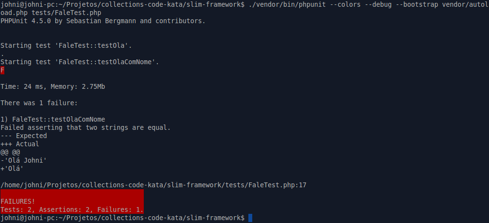

# Test Drivem Development(TDD) com PHPUnit

A ideia do TDD é testar pequenas partes de seu código com vários testes garantindo o correto funcionamento de cada parte e tudo isso de forma automatizada.

Se você está acostumado ao modelo tradicional de desenvolvimento de software onde primeiro é desenvolvido o código de produção você vai estranhar essa nova abordagem de desenvolvimento, pois você vai ter código testando código e o que pode parecer mais estranho é que o código de teste deve ser desenvolvido antes do código a ser testado.

Escrever código usando TDD e fazer o que que realmente você preciso e da forma mais simples possível, o feedback do teste é e ajuda a descobrir problemas o mais cedo possível no método ou classe que está sendo testado.

Outra grande vantagem e o foco no design da código, é fantástico como você consegue evitar o alto acoplamento de uma classe, você consegue ver como o seu código vai ficando o mais coeso possível e só exige a implementação do que você realmente precisa.

Quando você começa escrevendo um algorimo pelo teste, você vai estar desenhando a sua classe de acordo com o que precisa para executar , nesse cenário vamos evitando o alto acoplamento e a falta de coesão entre classes e métodos.

O PHPUnit, `https://phpunit.de/`, é uma ferramenta utilizar para desenvlver orientado a testes em PHP.

Vamos utilizar-la ao longo do Ebook para criar nossos testes.

### Instalando o PHPUnit

Vamos instalar o PHPUnit através do Composer. No arquivo `composer.json` inclua a seguinte linha:

```
"require-dev": {
        "phpunit/phpunit": "4.5.*"
}
```

Estamos informando ao Composer que o PHPUnit é uma dependencia utilizando somente em ambiente de desnvolvimento ou execução de teste, para concluir a instalação execute o comando `composer update` que atualiza todas as dependencias.

A instalação em abiente Linux ou Windows é feito da mesma maneira com o Composer. A única diferença está no modo de utilizar o PHPUnit. No Windows e necessário executar o comando dessa forma `.\vendor\bin\phpunit`, com a barra ( \\ ) invertida, já no Linux executamos o comando da seguinte forma, `./vendor/bin/phpunit`. 

De acordo com o sistema operacional que você está utilizando execute o comando apropriado.

> Eu estou utilizando Linux, portante ao longo do e-book estarei utilizando o comando apropriado para Linux, se voce estiver usando Windows utilize o commando com a barra invertida.

Com a instalação bem sucedidada do PHPUnit vamos criar o nosso primeiro teste. Na pasta `tests` crie o arquivo `FaleTest.php` e digite o seguinte código:

```php
use PHPUnit_Framework_TestCase as PHPUnit;

class FaleTest extends PHPUnit
{    
    public function testOla()
    {        
        $this->assertEquals("", "");
    }
    
}
```

Após isso no shell execute o seguinte comando, caso voce esteja usando Windows o comando é `.\vendor\bin\phpunit`.

`./vendor/bin/phpunit --colors --debug tests/FaleTest.php`.

Veja a saída no terminal.


O teste foi executado com sucesso, pois não estamos testanto nada ainda.

A classe `FaleTest` é heradada da classe `PHPUnit_Framework_TestCase`, isso faz com que o PHPUnit reconheca esse classe como uma classe de teste e possa executar os teste identificados por métodos publicos dessa classe que possuem o prefixo `test` em seu nome, `testOla`.

Observe que o método de teste `testOla` está utilizando o método `$this->assertEquals` que é utilizado para fazer a verificação do resultado esperado com o resultado atual, esse método faz parte da biblioteca do PHPUnit.

Existem outros métodos alem do `$this->assertEquals`, que são utilizado para verificar o resultado da execuação de um teste, esse métodos são conhecidos como *assertions métodos*, a documentação completa está disponivel em  `https://phpunit.de/manual/current/en/appendixes.assertions.html`, por hora vamos utilizar somente esse método.

Ao executar o PHPUnit passamos como parametro o `--color`, que destaca com cores o resutlado da execução do teste e `--debug` que mostra informações de durante a execução dos testes, alem de passar o caminho do arquivo da classe de teste.

### Criando nossso primeiro teste executavel

Vamos aprimorar nossos testes e criando uma classe para ser testada, para isso vamos incluir a seguinte linha no arquivo composer.json

```
"autoload": {
    "psr-0": {
    	"library": ""
	}
}
```
Esse linha informa que os arquivo presentes na pasta `library` do projeto serão carregados automaticamente pelo recurso de `autoloading` dessa forma para utilizar as arquivo desse diretório basta apenas incluir essa linha no projeto `require 'vendor/autoload.php';`.

Para gerar as novas informaçoes de `autoload` execute o comando `composer update`.

Altere o arquivo `tests/FaleTest.php` para que fique da seguinte forma:

```
use PHPUnit_Framework_TestCase as PHPUnit;
use library\Fale;

class FaleTest extends PHPUnit
{    
    protected $fale;

    public function testOla()
    {        
        $this->assertEquals("", $this->fale->ola());
    }

    public function setUp() {
        $this->fale = new Fale();
    }
}
```

Incluimos no arquivo a dependencia da classe `Fale` atraves da linha `use library\Fale;`, essa classe possui a lógica que vamos testar, reparea que declaramos uma variável `protected` para que possamos atribuir uma instalcia de `Fale` e no método `setUp` criamos a instancia. O método `setUp` é executado sempre quando um método de teste for invocado.

No método de teste `testOla` estamos fazerndo uso do método `ola` da classe `Fale`.

Execute o teste com o seguinte comando:

`./vendor/bin/phpunit --colors --debug tests/FaleTest.php`


Veja o resutlado, você percebeu um erro, é o motivo é obvio, a clase `Fale` não foi criada.

Vamos criar essa classe, no diretorio `library` crie o arqquivo `Fale.php` e crie a classe `Fale` com o métódo `ola`.

```
namespace library;

class Fale {

	public function ola() {
		return "Olá";
	}

}
```
Execute o teste com o comando:

`./vendor/bin/phpunit --colors --debug --bootstrap vendor/autoload.php tests/FaleTest.php`

Repare que estamos utilizando o parâmetro `--bootstrap vendor/autoload.php` esse parametros informa ao PHPUnit para usar o `autoload`, lembra que incluimos o diretório `library` no arquivo parametro `autoload` Composer, desse formas as classe da pasta `library` vão ser carregadas automaticamente durante a execução dos testes.

Veja o resutaldo do teste:


Ele falhou e o motivo é que o resutaldo esperado do método `testOla` é `""` é o resultado obtido é `"Ola"`. Para resolver é só alterar o resultado para esperado no método `testOla` para `"Ola"`.

```php
public function testOla()
{        
    $this->assertEquals("Olá", $this->fale->ola());
}
```
Execute novamente o teste, e veja o resultado:


Pronto, o teste passou, agora é só continuar implmentando outros métodos na classe `Fale`, sempre começando pelos testes. Vamos implementar outro método nessa classe.

Na classe `FaleTest` crie o método `testOlaComNome` com a seguinte implementação:

```
public function testOlaComNome()
{        
    $this->assertEquals("Olá Johni", $this->fale->ola("Johni"));
}
```
Agora execute o teste, `./vendor/bin/phpunit --colors --debug --bootstrap vendor/autoload.php tests/FaleTeste.php`.



Ocorreu um erro, isso é espereado, pois o método `ola` não possui implementação com o parametro `$nome`

Vamos resolver o erro, daptando na classe `Fale` o método `ola` para receber o parameto  `$nome`.

```
namespace library;

class Fale {

	public function ola() {

		if (func_num_args() === 1)
			return "Olá " . func_get_arg (0);
		else 
		  	return "Olá";
	}

}
```
Náo adaptamos a função para reconhecer como primeiro parametro e rotornar uma concatenação. Execute novamente o teste e veja o resutado.


Passou! Agora é podemos incluir outras assecoes, no método `testOlaComNome`, apesar de no nosso caso isso não ser importante pois o método `ola` com o parametro `nome` é muito simples, mas essa é uma prática interessante, fazer varias assecoes em um único método, para testar todas as possíbildiade de resutlado que esse método está sendo testado.


```
public function testOlaComNome()
{        
    $this->assertEquals("Olá Johni", $this->fale->ola("Johni"));
    $this->assertEquals("Olá Cristian", $this->fale->ola("Cristian"));
    $this->assertEquals("Olá Eduard", $this->fale->ola("Eduard"));
}
```

Execute novamentes os teste e veja o resultado.

 `./vendor/bin/phpunit --colors --debug --bootstrap vendor/autoload.php tests/FaleTeste.php`.


Todos os testes e asserções passaram.

### Conclusão


### Atividades

Vamos prticar TDD. Crie uma nova classe de teste chamada `CalculadoraTest` na pasta `tests` e teste as operações basicas da matematica: `subtração`; `adição`; `multiplicação` e `divisão`. Não se esqueça de criar a classe `Calculadora` na pasta `library`.

### Dicas

É fantatisco desenvolver guiado por testes os beneficio são enormes, faça uma pesquisa rapida na internet sobre TDD e não deixe de estudar melhor essa técnica, outra dica é acesar o site TDD Problemns, `https://sites.google.com/site/tddproblems/`, lá você encontra uma coleção de problemas para serem resolvido utilizando TDD, escolhar algums problemas e tente resolver com o PHPUnit.

Você gostou de utilizar o PHPUnit, então não deixe de conferir a documentação oficial  em `https://phpunit.de/documentation.html` para conhecer melhora a ferramenta.
